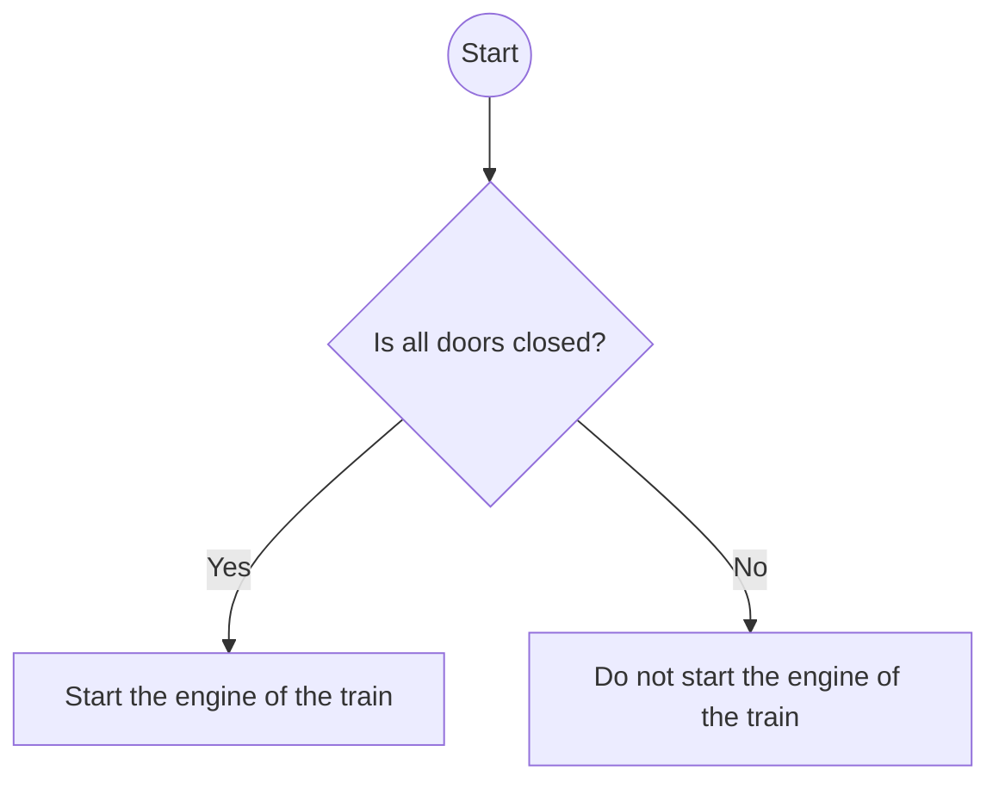

# Train System

A demo to show how to stop a train if door opens.

```mermaid
flowchart

  Start@{ shape: circle, label: "Start" }
  IsAllDoorClosed@{ shape: diamond, label: "Is all doors closed?" }
  TrainStart@{ shape: rect, label: "Start the engine of the train" }
  TrainDoNotStart@{ shape: rect, label: "Do not start the engine of the train" }
  
  Start --> IsAllDoorClosed
  IsAllDoorClosed -- Yes --> TrainStart
  IsAllDoorClosed -- No --> TrainDoNotStart
```